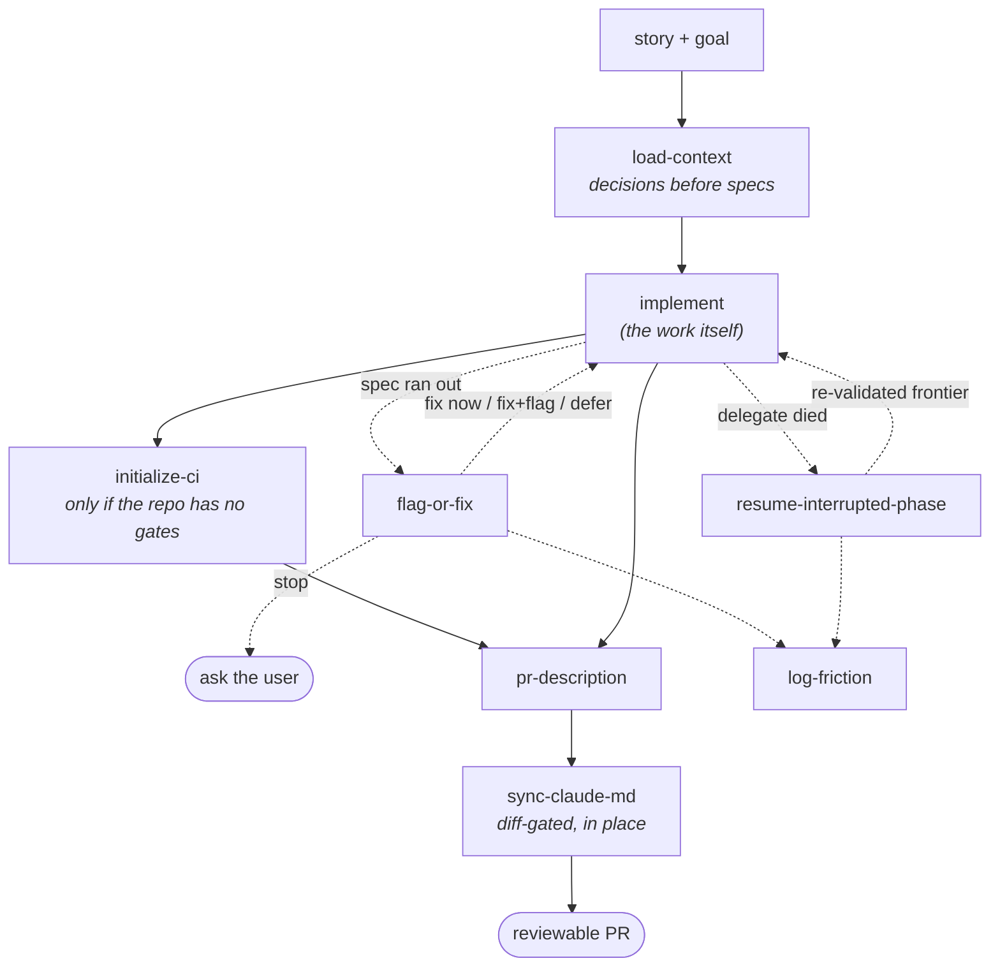

# Amphion — the pipeline

**Amphion** 🎼 is seven markdown skills that together carry spec-driven work from *what was
already decided* to *a reviewable pull request*. There is no engine and no runtime: each skill is a
procedure a Claude Code session follows, and the only shared state is
`.claude/amphion.config.json` plus the repository itself.

This document covers the shape of the pipeline, how the stages hand off, and where each skill
reads its project-specific facts from. Per-stage detail lives in each `SKILL.md`.

## Shape

Solid edges are the happy path; dotted edges are the exception handlers. The two dotted branches
off `implement` are the point of the whole package — they are the failure modes that actually end
long autonomous runs, and each has a defined procedure instead of improvisation.

## The two hard problems

**The spec ran out.** Every spec-driven pipeline eventually meets a situation the spec doesn't
address, and the default failure is an agent quietly deciding for itself and burying the decision
in a diff. [`flag-or-fix`](../plugin/skills/flag-or-fix/SKILL.md) makes that moment explicit: an
eight-row classification table catches the common cases, a four-question tree handles the rest, and
every branch ends by *writing the decision down* — under headings that
[`pr-description`](../plugin/skills/pr-description/SKILL.md) then emits, so a reviewer sees it.

**The delegate died.** When a delegated implementation agent returns an API error, a truncated
message, or a bare "completed," the code it wrote is usually fine — git has it. What died is the
**validation status**: which gates were run, what the project's mandated checks reported, what
deviations were flagged. That signal is invisible when missing; an unvalidated commit looks exactly
like a validated one.

[`resume-interrupted-phase`](../plugin/skills/resume-interrupted-phase/SKILL.md) treats a
non-contract return as a crash by default, reconstructs the true state from git plus an in-repo
ledger, re-establishes the lost validation on the frontier, and only then resumes. Its three
supporting files carry the mechanics: the [runbook](../plugin/skills/resume-interrupted-phase/runbook.md)
(commands and truth tables), the [report contract](../plugin/skills/resume-interrupted-phase/report-contract.md)
(what an implementer must return, and how you decide a return is a crash), and the
[resume brief](../plugin/skills/resume-interrupted-phase/resume-brief-template.md) (the verbatim
block that makes a relaunched agent idempotent).

## Configuration resolution

Every skill resolves project facts in the same order:

1. **`.claude/amphion.config.json`** — the project's own answer.
2. **Repository evidence** — build files, existing branches, `git remote show origin`.
3. **Ask the user** — and offer to write the answer into the config so the next session doesn't
   have to ask again.

There is no step 4. No skill in this package guesses a path, a command, or a document set silently.

The config is also where every project-specific fact lives that used to be hardcoded: the document
set and its read order, the ledger path, the build/test commands, the project's mandated checks,
the integration branch, the friction-log sink, and the doc-to-code map. See the
[config table](../README.md#configure) for the full key list.

## Why `sync-claude-md` is the smallest stage

`sync-claude-md` is the only stage that ships deliberately *less* capable than the version it came
from, and the reasoning generalizes past this package.

Its predecessor ran at the end of every phase and brought each in-scope `CLAUDE.md` up to date.
Both halves of that description turned out to be defects:

| Behaviour | Consequence |
|---|---|
| "Bring up to date" → **append what's missing** | Context files accumulated history and grew into changelogs. A long context file is a worse context file: the fact the next session needs is buried in everything that ever happened. |
| **Run every phase**, regardless of the diff | Every branch touched the same few files near the same lines. PRs sharing no code at all still collided, and the conflicts cost more than the staleness did. |

The narrowed skill inverts both: it may only **rewrite in place**, and only for a document whose
described code changed **in this same diff**. Anything that would grow a document is reported to
the user instead of written. Two PRs that touch no common code now touch no common documentation.

The rationale is duplicated inside the skill itself — deliberately, since a future reader
encountering it will be reading the `SKILL.md`, not this document, at the moment they're tempted to
widen it back.

## Provenance

These seven skills were extracted from a working spec-driven delivery pipeline and generalized for
release: the document set, branch model, gate commands, project invariants, and friction sink are
now configuration rather than hardcoded assumptions, and the shipped defaults require no external
service. The procedures are unchanged except where noted above.
