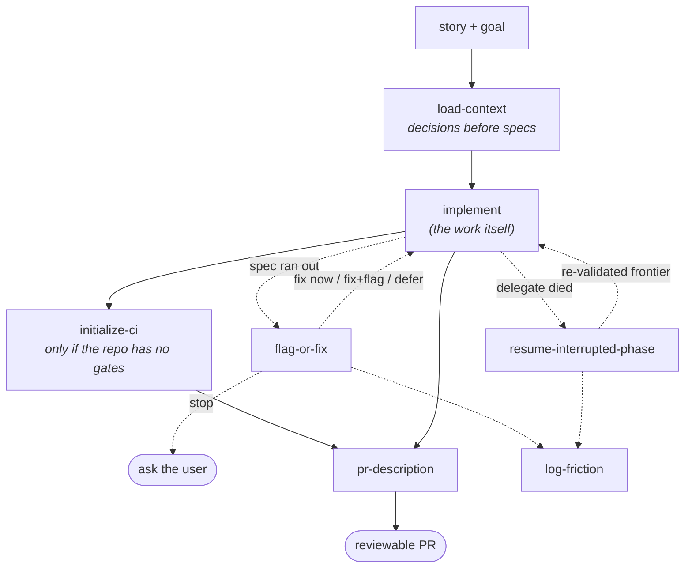

# Amphion — the pipeline

**Amphion** 🎼 is six markdown skills that together carry spec-driven work from *what was
already decided* to *a reviewable pull request*. There is no engine and no runtime: each skill is a
procedure a Claude Code session follows, and the only shared state is
`.claude/amphion.config.json` plus the repository itself.

This document covers the shape of the pipeline, how the stages hand off, and where each skill
reads its project-specific facts from. Per-stage detail lives in each `SKILL.md`.

## Shape

```mermaid
flowchart TB
    START["story + goal"] --> LC["load-context<br/><i>decisions before specs</i>"]
    LC --> IMPL["implement<br/><i>(the work itself)</i>"]

    IMPL -.->|"spec ran out"| FOF["flag-or-fix"]
    FOF -.->|"fix now / fix+flag / defer"| IMPL
    FOF -.->|"stop"| USER(["ask the user"])

    IMPL -.->|"delegate died"| RIP["resume-interrupted-phase"]
    RIP -.->|"re-validated frontier"| IMPL

    IMPL --> CI["initialize-ci<br/><i>only if the repo has no gates</i>"]
    CI --> PR["pr-description"]
    IMPL --> PR
    PR --> DONE(["reviewable PR"])

    FOF -.-> FRIC["log-friction"]
    RIP -.-> FRIC
```

Solid edges are the happy path; dotted edges are the exception handlers. The two dotted branches
off `implement` are the point of the whole package — they are the failure modes that actually end
long autonomous runs, and each has a defined procedure instead of improvisation.

## The two hard problems

**The spec ran out.** Every spec-driven pipeline eventually meets a situation the spec doesn't
address, and the default failure is an agent quietly deciding for itself and burying the decision
in a diff. [`flag-or-fix`](../plugin/skills/flag-or-fix/SKILL.md) makes that moment explicit: an
eight-row classification table catches the common cases, a four-question tree handles the rest, and
every branch ends by *writing the decision down* — under headings that
[`pr-description`](../plugin/skills/pr-description/SKILL.md) then emits, so a reviewer sees it.

**The delegate died.** When a delegated implementation agent returns an API error, a truncated
message, or a bare "completed," the code it wrote is usually fine — git has it. What died is the
**validation status**: which gates were run, what the project's mandated checks reported, what
deviations were flagged. That signal is invisible when missing; an unvalidated commit looks exactly
like a validated one.

[`resume-interrupted-phase`](../plugin/skills/resume-interrupted-phase/SKILL.md) treats a
non-contract return as a crash by default, reconstructs the true state from git plus an in-repo
ledger, re-establishes the lost validation on the frontier, and only then resumes. Its three
supporting files carry the mechanics: the [runbook](../plugin/skills/resume-interrupted-phase/runbook.md)
(commands and truth tables), the [report contract](../plugin/skills/resume-interrupted-phase/report-contract.md)
(what an implementer must return, and how you decide a return is a crash), and the
[resume brief](../plugin/skills/resume-interrupted-phase/resume-brief-template.md) (the verbatim
block that makes a relaunched agent idempotent).

## Configuration resolution

Every skill resolves project facts in the same order:

1. **`.claude/amphion.config.json`** — the project's own answer.
2. **Repository evidence** — build files, existing branches, `git remote show origin`.
3. **Ask the user** — and offer to write the answer into the config so the next session doesn't
   have to ask again.

There is no step 4. No skill in this package guesses a path, a command, or a document set silently.

The config is also where every project-specific fact lives that used to be hardcoded: the document
set and its read order, the ledger path, the build/test commands, the project's mandated checks,
the integration branch, and the friction-log sink. See the
[config table](../README.md#configure) for the full key list.

## Docs are a rule, not a stage

Amphion used to end with a seventh skill, `sync-claude-md`, that corrected the documentation a diff
made wrong. It shipped already narrowed: an earlier version ran after every phase and "brought each
`CLAUDE.md` up to date", which appended history until the context files became changelogs, and
touched the same file in every PR. The narrowed skill could only rewrite in place, and only for a
document whose described code changed in the same diff.

It was retired anyway, because the narrowed version turned out to be a rule restated as a
procedure. The agent that changes the code is already the one obliged to fix the docs describing
it, in the same change. Measured across the runs that could still be found, a separate docs pass
mostly **added** text, all of it to repo-root instruction files that load into every later
session, and caught little real drift. The last version is at the `sync-claude-md-final` tag.
The evidence is in the stage 1 assessment,
[Appendix A](../../docs/stage1-assessment-2026-09-30.md#appendix-a-d9-deep-dive-does-sync-claude-md-earn-its-place).

Two things replace it:

1. **A written rule about where detail lands.** Detail goes in the *leaf*: the module docstring,
   the spec, the README beside the code, none of which loads automatically. Auto-loaded
   instruction files (`AGENTS.md`, `CLAUDE.md`, Copilot and Cursor rules) stay routers: they say
   what exists and where to look. They carry no volatile state (no statuses, counts, dates or
   phase lists), since that is exactly the text that goes stale. The same-change rule still binds
   whoever changes behaviour to correct the docs describing it.
2. **A mechanical check.** A pointer lint in CI fails when a Markdown link or a backticked repo path
   no longer resolves. It catches renamed and deleted files, the one class of drift a machine sees
   reliably, and unlike a skill it can never append. Zethus ships a portable one,
   [`docs-pointer-check.py`](../../zethus/scripts/docs-pointer-check.py); the repository that
   hosts Amphion runs its own, [`scripts/check_doc_pointers.py`](../../scripts/check_doc_pointers.py).

## Provenance

These skills were extracted from a working spec-driven delivery pipeline and generalized for
release: the document set, branch model, gate commands, project invariants, and friction sink are
now configuration rather than hardcoded assumptions, and the shipped defaults require no external
service. The procedures are unchanged except where noted above, and one extracted skill,
`sync-claude-md`, has since been retired (see [Docs are a rule, not a
stage](#docs-are-a-rule-not-a-stage)).
