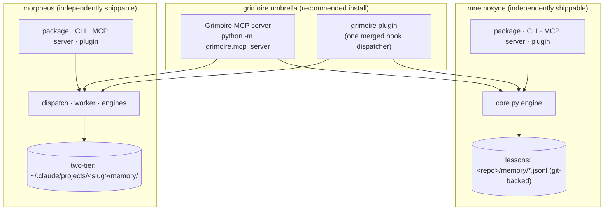
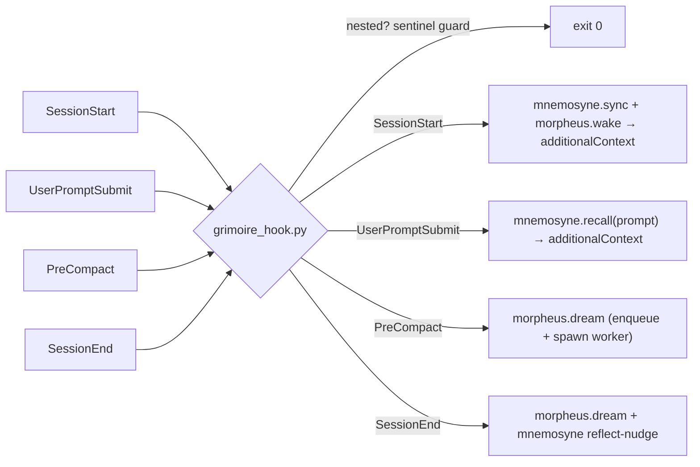

# Grimoire — architecture

**Grimoire** 📖 is the book that holds both: a thin umbrella uniting two independent Claude Code
memory engines under **one MCP server** and **one plugin**.

- 🧠 **mnemosyne** — reflexion *lessons* memory. Deliberate, git-backed, PR-governed. Tools:
  `recall` `capture` `reflect` `promote` `prune` `hygiene`.
- 🌙 **morpheus** — automatic session *dreaming* / consolidation. Background, per-project. Tools:
  `dream` `wake` `dreams`.

Grimoire adds no new memory model. It composes the two engines' public library APIs — nothing
more. Each engine remains independently installable (package · CLI · MCP server · plugin); Grimoire
just unifies the surface for people who want both at once.

## Composition

The Grimoire MCP server (`grimoire/src/grimoire/mcp_server.py`) imports `mnemosyne` and `morpheus`
and re-exposes all nine tools as thin adapters over their library APIs (`mn.recall(...)`,
`mo.dream(...)`, ...) — it never touches the engines' own MCP servers.

## Unified lifecycle hook dispatch (no double-firing)

Installing *both* engines' standalone plugins would register competing SessionStart / SessionEnd
hooks. The Grimoire plugin instead ships **one** dispatcher (`grimoire_hook.py`) registered for
every lifecycle event, which runs each engine's concern in turn:

The dispatcher is **fail-open** (a missing engine or any error exits 0 and stays silent) and guards
nested sessions first (`CLAUDE_MORPHEUS` / `CLAUDE_CODE_CHILD_SESSION`) so morpheus's headless
`claude -p` dreamer never re-triggers the hooks.

## Two stores, one roof

Grimoire deliberately does **not** merge the memory backends — they serve different purposes:

| Engine | Store | Written | Read back by |
|---|---|---|---|
| mnemosyne | `<repo>/memory/lessons.jsonl` + `local.jsonl` (git-backed) | deliberately, via `/reflect` `/capture` or the tools, with PR promotion | `recall` (on prompt) |
| morpheus | `~/.claude/projects/<slug>/memory/<type>-<slug>.md` + `MEMORY.md` | automatically, by the background dreamer | `wake` (on session start) + Claude Code's own recall |

Unifying them into a single store (a "dual-write bridge") is intentionally out of scope for now.

## Install choices

- **Grimoire plugin** — both engines, one dispatcher, one server. Recommended.
- **A single engine's plugin** (`mnemosyne/plugin` or `morpheus/plugin`) — just that engine.
- Never a standalone plugin *and* Grimoire together (their hooks would double-fire).

The engines' own designs: [`mnemosyne/docs/design.md`](../../mnemosyne/docs/design.md) ·
[`morpheus/docs/architecture.md`](../../morpheus/docs/architecture.md).
