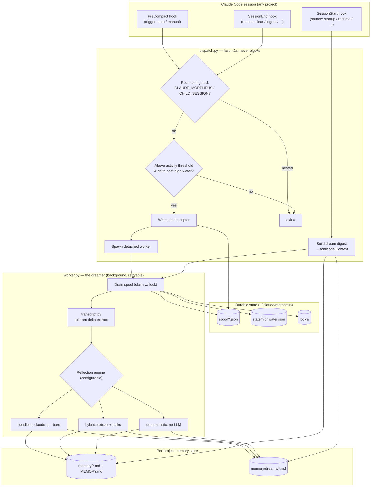
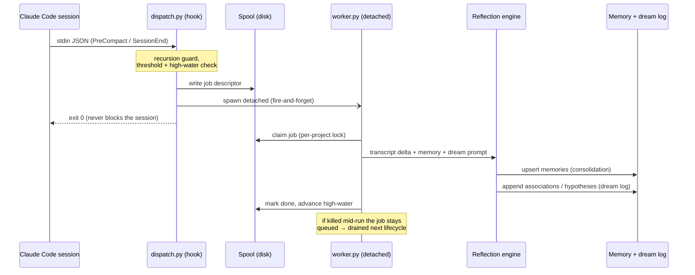
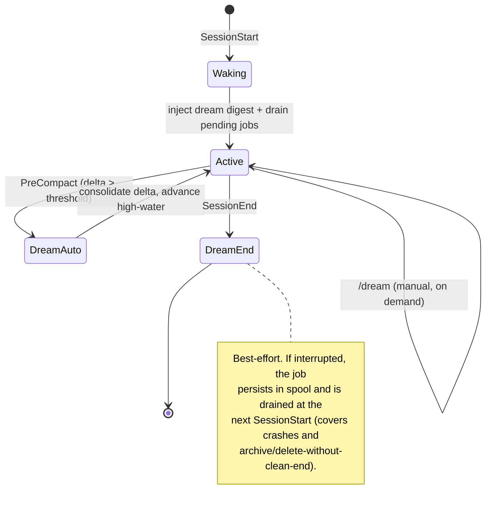
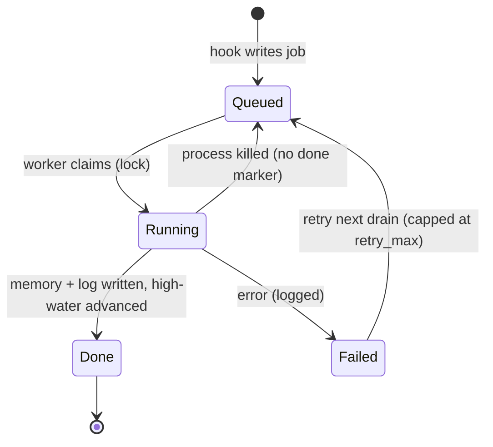
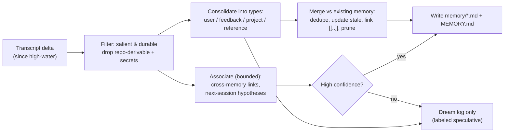

# Morpheus — architecture

**Dreaming** is offline memory consolidation for Claude Code. When a session is about to lose
context — **compaction**, **session end**, or (transitively) **archive/delete** — a background
process reflects over the transcript, distills the durable signal, and writes it into the
persistent memory store. It is the agent's "sleep": short-term experience consolidated into
long-term memory.

The design borrows from biological memory consolidation (hippocampal replay during sleep) and
from the **reflection** step in *Generative Agents* (Park et al., 2023) and *Reflexion* (Shinn et
al., 2023). The consolidation core is paired with a bounded **association** pass — the evocative
part of dreaming — guard-railed so speculation never masquerades as fact.

## At a glance

| Concern | Choice |
|---|---|
| Triggers | `PreCompact`, `SessionEnd` (dream); `SessionStart` (wake); `/dream` (manual) |
| Execution | 3 interchangeable engines: `headless` (default), `hybrid`, `deterministic` |
| Output | `memory/<type>-<slug>.md` + `MEMORY.md` index, plus a `memory/dreams/*.md` log |
| Language | Python 3, standard library only (no pip dependencies) |
| Durability | A persisted spool + per-session high-water mark + retry/quarantine |
| Safety | Triple recursion guard, secret redaction, never blocks the session |

## 1. Components & data flow



## 2. Dream sequence (PreCompact / SessionEnd)

The hook is deliberately trivial and fast: it enqueues a durable job and spawns a detached worker,
then exits. It never blocks the session (and `SessionEnd` cannot be blocked anyway).



## 3. Session lifecycle (wake / dream)



## 4. Dream job state machine (durability)

Claude Code may terminate a hook's child-process tree when the session exits, so durability cannot
rely on the spawned worker surviving. Instead, the **spool is the source of truth**: a job is only
removed after the dream completes. Anything interrupted is retried on the next drain.



## 5. Reflection engine internals (consolidation + association)



## Key mechanisms

### High-water mark

`state/highwater.json` records, per `session_id`, how many transcript **records** have been
consolidated. Each dream processes only the delta since that mark, so a mid-session `PreCompact`
dream and the later `SessionEnd` dream never re-ingest the same messages. The unit is the raw
record (line) count, which is stable because transcripts only append.

### Recursion guard (triple)

The headless/hybrid engines run `claude -p`, which is itself a Claude Code session that would fire
`SessionEnd` → another dream. This is prevented three ways:

1. `--bare` makes the nested run skip hook/skill/memory auto-discovery (so the dreaming hooks never
   load inside it).
2. The `CLAUDE_MORPHEUS=1` sentinel is set on the worker and its children; `dispatch.py` exits
   immediately if it sees it.
3. `CLAUDE_CODE_CHILD_SESSION=1` (set by Claude Code in hook/subprocess chains) is also honored.

### Archive / delete

Claude Code exposes **no** archive or delete hook — `SessionEnd` is the only end-of-life signal.
For the normal flow this is fine: by the time a session is archived or deleted, its content was
already consolidated at the last `PreCompact`/`SessionEnd`. For sessions that ended via a crash (no
clean `SessionEnd`), the optional **reconciliation sweep** (`reconcile.py`, run on a schedule)
scans transcripts for any session grown past its high-water mark and enqueues a dream.

### Never break the host session

`dispatch.py` swallows every error and exits `0`. A bad config, an unparseable transcript, or a
failed spawn can never surface into — or slow down — the user's session.

## The three engines

All implement one interface (`run(**ctx) -> DreamResult`) and produce the same output contract, so
they are hot-swappable via `config.json` `mode`:

- **`headless`** (default) — a background `claude -p --bare` run does the reflection and writes the
  memory files itself with Read/Edit/Write, returning a JSON summary. Most capable; costs tokens.
- **`hybrid`** — the deterministic engine prefilters the transcript into candidates, then a small
  model (haiku) refines them into structured memories. This process writes the files. Cheaper.
- **`deterministic`** — pure Python heuristics (session topic, files touched, user corrections);
  zero added tokens, no association pass. Always available offline; used as the test oracle.

## Memory format

Dreams write the same two-tier store used elsewhere:

```
memory/
  <type>-<slug>.md        # frontmatter: name, description, metadata.{node_type,type,originSessionId}
  MEMORY.md               # index: "- [Title](file.md) — hook"
  dreams/
    <ts>-<session>.md     # per-dream log: summary, memories, associations, hypotheses
```

Types are `user`, `feedback`, `project`, `reference`. See `morpheus/src/morpheus/prompts/dream.system.md`
for the exact consolidation rules the engines follow.

## Testing

The suite (`tests/`, `python -m unittest`) runs fully offline:

- core primitives (memory round-trip, tolerant transcript parsing, spool/lock/high-water),
- the deterministic engine against a fixture transcript (golden behavior),
- headless/hybrid via an injected mock `runner` (no real `claude` needed),
- `dispatch.py` end-to-end as a subprocess (enqueue, recursion guard, threshold, wake digest),
- the worker end-to-end (write memory + dream log + advance high-water; idempotent re-run).
