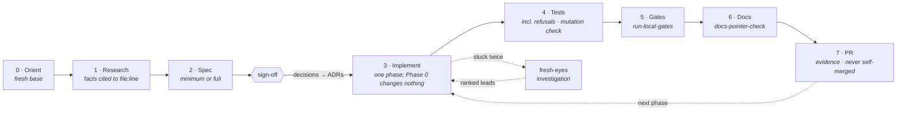

# Zethus 🪨

**A development process for GitHub Copilot, in a form Copilot can follow and enforce.** One custom
agent runs every change through research → spec → sign-off → phased implementation → tests → local
gates → a PR with evidence, and refuses to skip a stage. Ten standalone skills hold one procedure
each. Four Markdown templates and five stdlib Python scripts do the mechanical parts. It installs into
a repository's `.github/` folder, or once for your user account under `~/.copilot/` so it follows
you into every repo without changing any of them. Nothing in it is specific to one organization.

> Amphion and his twin Zethus built the walls of Thebes. Amphion played his lyre and the stones set
> themselves. Zethus carried each stone by hand and set it true. [Amphion][amphion] is the
> Claude Code pipeline. This is its Copilot twin: same walls, the other brother's method.

## The procedure



The agent states which stage it's in at the top of every reply. It asks decisions as a short list
of options with the recommendation first and marked, and it records each answer as an ADR. Its
refusals are written into the agent file as a table. "Skip the spec" gets the minimum spec, about
ten minutes. "Just push, CI will tell us" gets the local gates. "Merge it" gets a no: a person
merges, only on green. One narrow exemption is written down too. A change with no behaviour change
(a typo, a comment, formatting) may skip research, spec and tests, but never gates, docs or the PR.

## What's in the kit

| File | Installs to | Purpose |
|---|---|---|
| [`copilot-instructions.md`](copilot-instructions.md) | `.github/copilot-instructions.md` | The standing rules, short and imperative. Copilot loads them for every request in the repo. |
| [`instructions/docs.instructions.md`](instructions/docs.instructions.md) | `.github/instructions/` | Path-scoped rules (`applyTo: "**/*.md"`): Markdown is canonical, router vs leaf docs, pointers resolve, spec status vocabulary, ADRs superseded rather than rewritten. |
| [`agents/zethus.agent.md`](agents/zethus.agent.md) | `.github/agents/` | **The enforcer.** The stage table with exit conditions, per-turn behaviour, and the refusal table. |
| [`skills/research-existing-code`](skills/research-existing-code/SKILL.md) | `.github/skills/` | Facts cited to `file:line`, the search behind every negative claim, and what the research did *not* cover. |
| [`skills/write-spec-minimum`](skills/write-spec-minimum/SKILL.md) | `.github/skills/` | The one-screen spec for one PR, and the fast path when someone says "just code it". |
| [`skills/write-spec-full`](skills/write-spec-full/SKILL.md) | `.github/skills/` | Verbatim ask, measured problem, facts, assumptions checked, options, phases, rollback, out of scope, open questions, then stop for sign-off. |
| [`skills/write-adr`](skills/write-adr/SKILL.md) | `.github/skills/` | One imperative decision sentence, options, consequences, *enforced where*, *revisit when*. Pastes cleanly into a wiki or ticket. |
| [`skills/fresh-eyes-investigation`](skills/fresh-eyes-investigation/SKILL.md) | `.github/skills/` | Artifact plus one line of intent in; ranked leads out, each established or conjecture. Never a diagnosis; an empty list is valid. |
| [`skills/implement-phase`](skills/implement-phase/SKILL.md) | `.github/skills/` | One phase per branch (or per commit series, in `rebase` style), Phase 0 first. Stay inside the phase; classify anything unplanned; keep an *As built* list. |
| [`skills/test-plan`](skills/test-plan/SKILL.md) | `.github/skills/` | Per-phase tests covering the change, the failure path, the refusal, and what must not change, plus a mutation check. |
| [`skills/pre-push-gates`](skills/pre-push-gates/SKILL.md) | `.github/skills/` | Every CI gate run locally, on the working tree, before a push. A skip is not a pass. |
| [`skills/pr-description`](skills/pr-description/SKILL.md) | `.github/skills/` | An evidence-first PR body diffed against the real integration branch, including *What was not checked*. |
| [`skills/docs-sync-check`](skills/docs-sync-check/SKILL.md) | `.github/skills/` | Fix the docs that describe the changed code in the same PR, in place. Leave every other doc alone. |
| [`templates/spec-full.md`](templates/spec-full.md) · [`spec-minimum.md`](templates/spec-minimum.md) | `.github/zethus/templates/` | Both spec shapes. The minimum spec's headings are a strict subset of the full spec's, so promoting one only adds sections. A test enforces this. |
| [`templates/adr.md`](templates/adr.md) | `.github/zethus/templates/` | The ADR record: a field table (including *Enforced where*), decision, context, options, consequences. |
| [`templates/pr.md`](templates/pr.md) | `.github/zethus/templates/` | The PR body: What · Why · Changes · Evidence · What was not checked · deferrals · decisions · docs · AI assistance. |
| [`scripts/run-local-gates.py`](scripts/run-local-gates.py) | `.github/zethus/scripts/` | Discovers and runs lint/build/test, then prints a PASS/FAIL/SKIP table and an explicit verdict. Prefers a repo's `mvnw`/`gradlew` wrapper; on Windows a bare `mvn` or `./mvnw` resolves to `mvn.cmd`/`mvnw.cmd` through `PATHEXT`. Exit codes: `0` full green · `1` red · `3` green but incomplete · `2` nothing to run. |
| [`scripts/base-freshness.py`](scripts/base-freshness.py) | `.github/zethus/scripts/` | Fetches, counts the commits in `HEAD..origin/<base>`, and stops the stage if there are more than `branchModel.maxBehind`. Prints the merge-base to diff against, and whether the branch was rewritten since its last push. The agent runs it at the start of every stage. Exit codes: `0` fresh · `1` stale, rebase first · `2` usage error · `3` no answer (the fetch failed). |
| [`scripts/new-adr.py`](scripts/new-adr.py) | `.github/zethus/scripts/` | Creates `docs/adr/YYYY-MM-DD-slug.md` and adds its row to the ADR index. Ids are keyed by date, so parallel branches never collide. |
| [`scripts/new-spec.py`](scripts/new-spec.py) | `.github/zethus/scripts/` | `new-spec.py full\|minimum "Title"` creates `docs/specs/<slug>.md` as `DRAFT`. |
| [`scripts/docs-pointer-check.py`](scripts/docs-pointer-check.py) | `.github/zethus/scripts/` | Fails on relative Markdown links that don't resolve, including case mismatches that only break on Linux. With `--sync-base`, it also lists docs whose described code changed (report-only). |
| [`zethus.config.example.json`](zethus.config.example.json) | `.github/zethus.config.json` | Project facts: integration branch, gate commands, spec and ADR dirs, the doc-to-code map, the AI co-author trailer. |
| [`install.py`](install.py) | — | Copies all of the above into place: into a repo (`--target`) or for your user account (`--user`, with `--uninstall`). Never clobbers a file it didn't write, and writes nothing if there are conflicts. |

The scripts are Python 3.10+ standard library only. There are no PowerShell twins: Python runs
natively on Windows, and a second implementation would be a second thing to drift.

## Install

There are two modes. Pick one per machine and repo; they don't need each other.

| | Repo mode (`--target`) | User mode (`--user`) |
|---|---|---|
| Where it goes | The repo's `.github/`, committed | `~/.copilot/`, on your machine only |
| Who gets it | Everyone who clones the repo, plus the Copilot cloud agent | You, in every repo you open |
| Changes the repo | Yes: a PR adding `.github/` files | No. Optional per-repo config stays untracked |
| Right when | The team adopts the process | You may not commit to `.github/`, or you want it everywhere |

### Install into a repository

```bash
git clone https://github.com/kumouri/claude-grimoire.git
python claude-grimoire/zethus/install.py --target path/to/your-repo --dry-run   # see the plan
python claude-grimoire/zethus/install.py --target path/to/your-repo
```

Then, in the target repo:

1. Edit `.github/zethus.config.json`. Set `gates.steps` to mirror your CI workflow, gate for gate.
   `run-local-gates.py --list` shows what it would run.
2. Commit the `.github/` changes in a PR like any other change.
3. In your Copilot chat, pick the **zethus** agent to run the whole procedure. Or invoke a single
   skill, such as `/write-spec-minimum` or `/fresh-eyes-investigation`, on its own.

If the repo already has a `.github/copilot-instructions.md`, the installer leaves it alone and
installs the rules as `.github/instructions/zethus.instructions.md` with `applyTo: "**"`. Copilot
combines path-specific and repository-wide instructions, so both apply. Copying by hand works too:
the *Installs to* column above is the whole mapping.

### Install for your user account (every repo, no commit)

```bash
python claude-grimoire/zethus/install.py --user --dry-run   # see the plan
python claude-grimoire/zethus/install.py --user
python claude-grimoire/zethus/install.py --user --uninstall # later, to remove it
```

Add `--jetbrains-legacy` only for an older JetBrains Copilot plugin that doesn't read
`~/.copilot/instructions` (see the support table below).

| Kit piece | User-mode location |
|---|---|
| Working agreement (`copilot-instructions.md`) | `~/.copilot/instructions/zethus.instructions.md`, with `applyTo: "**"`. Your own `~/.copilot/copilot-instructions.md` is left alone. |
| `instructions/docs.instructions.md` | `~/.copilot/instructions/zethus-docs.instructions.md` |
| `agents/zethus.agent.md` | `~/.copilot/agents/` |
| `skills/<name>/` | `~/.copilot/skills/<name>/` |
| Templates, scripts | `~/.copilot/zethus/templates/`, `~/.copilot/zethus/scripts/` |
| Example config | `~/.copilot/zethus/config.example.json`, for reference only |
| Working agreement, for older JetBrains builds | Only with `--jetbrains-legacy`: `global-copilot-instructions.md` in JetBrains' Copilot folder, and only if you don't have one |

The installed Markdown is rewritten on the way. Every `.github/zethus/…` path becomes the absolute
path of your user-level copy, and each mention of the config lists the full resolution order
below. So the agent and skills run `python <home>/.copilot/zethus/scripts/run-local-gates.py`
from any repo.

The user install is careful about your files:

- **A file it didn't write is never overwritten**, even with `--force`. If you already have a
  `~/.copilot/skills/pr-description/`, for example, it stops, lists the clash, and writes nothing.
- Every file it writes is recorded with its SHA-256 in `~/.copilot/zethus/install-manifest.json`.
  Re-running it upgrades the files you haven't edited. A kit file you *have* edited is a conflict
  unless you pass `--force`.
- `--uninstall` removes only the manifest's files that you haven't edited (`--force` removes
  edited ones too), then any folders that became empty. Your own files, including
  `~/.copilot/zethus/config.json`, stay.
- It writes no `config.json`. A user default holding example gates would override discovery in
  every repo, so `npm run lint` would run in a Maven project.

`~/.copilot` is used even when `COPILOT_HOME` is set. Only the Copilot CLI honours that variable, so
a kit installed there would be invisible to VS Code and JetBrains.

#### Which Copilot clients read the user-level files

VS Code and the CLI were checked against GitHub's and VS Code's documentation in September 2026.
The JetBrains column rests on something stronger than the docs: a user's own IntelliJ settings
screen (below). User-level files are local, so **the Copilot cloud agent on github.com never sees
them**; it needs repo mode.

| Piece | VS Code Copilot Chat | Copilot CLI | JetBrains (IntelliJ etc.) |
|---|---|---|---|
| Agent, `~/.copilot/agents/` | Yes ([docs][vsc-agents]) | Yes ([docs][cli-ref]) | Yes: a default location in the settings screen ([changelog][jb-agents] agrees) |
| Skills, `~/.copilot/skills/` | Yes ([docs][vsc-skills]) | Yes ([docs][cli-skills]) | Yes: a default location in the settings screen ([docs][gh-skills] agree). Older builds: see bug #1517 below |
| Instructions, `~/.copilot/instructions/*.instructions.md` | Yes ([docs][vsc-instructions]) | Yes ([docs][cli-instr]) | Yes: a default location in the settings screen. The docs still describe only `global-copilot-instructions.md` ([docs][jb-instr]) |
| JetBrains `global-copilot-instructions.md` (`--jetbrains-legacy` only) | — | — | Windows: `%LOCALAPPDATA%\github-copilot\intellij\`. macOS: `~/.config/github-copilot/intellij/`. **Linux: not documented**, so the installer skips it and says so ([docs][jb-instr]) |

**The JetBrains evidence.** In September 2026, the IntelliJ Copilot settings page *Tools → GitHub
Copilot → Customizations* listed these default locations, all enabled. The plugin version wasn't
visible, so it is unknown which build introduced them.

| Setting | Default locations |
|---|---|
| Instruction File Locations (`*.instructions.md`) | `.github/instructions`, `~/.copilot/instructions` |
| Agent File Locations (`*.agent.md`) | `.claude/agents`, `.github/agents`, `~/.copilot/agents` |
| Skill File Locations (folders of `SKILL.md`) | `.agents/skills`, `.claude/skills`, `.github/skills`, `~/.agents/skills`, `~/.claude/skills`, `~/.copilot/skills` |
| Prompt File Locations (`*.prompt.md`) | `.github/prompts`, `~/.copilot/prompts` |
| Hook File Locations (`*.json`) | `.github/hooks`, `~/.copilot/hooks` |

The same page has toggles for organization instructions, `AGENTS.md` and `CLAUDE.md` (nested
variants experimental), plus a *Plugin Marketplaces* list.

**Older JetBrains builds.** Before this settings page, the docs described one global instructions
file, `global-copilot-instructions.md`, and no `~/.copilot/instructions` ([docs][jb-instr]). An open
report says user-level `.copilot` skills weren't detected on Windows ([#1517][jb-skills-bug]). If
your plugin has no *Customizations* page, or the kit doesn't show up:

- update the plugin; or
- re-run with `--jetbrains-legacy` to also write `global-copilot-instructions.md`.

Don't use the flag on a current build. Copilot would then read the working agreement twice, once
from each file.

Sources, with the sentence each claim rests on:

- [VS Code: custom agents][vsc-agents]: Agent Host reads agents "from the selected host's folder",
  `~/.copilot/agents` or `~/.claude/agents`.
- [VS Code: agent skills][vsc-skills]: personal skills in `~/.copilot/skills/`, `~/.claude/skills/`
  or `~/.agents/skills/`.
- [VS Code: custom instructions][vsc-instructions]: "For personal, always-on instructions in Copilot
  Agent Host sessions, use `~/.copilot/copilot-instructions.md`", and "User instructions in Agent
  Host folders, such as `~/.copilot/instructions` … do not roam through Settings Sync."
- [VS Code: Copilot settings reference][vsc-settings]: the defaults of `chat.agentFilesLocations`,
  `chat.agentSkillsLocations` and `chat.instructionsFilesLocations`, each deprecated and used only
  by the Local agent.
- [Copilot CLI: customization reference][cli-ref]: user agents in `~/.copilot/agents/` load first.
- [Copilot CLI: add skills][cli-skills]: personal skills in `~/.copilot/skills` or `~/.agents/skills`.
- [Copilot CLI: add custom instructions][cli-instr]: `$HOME/.copilot/copilot-instructions.md` and
  `$HOME/.copilot/instructions/**/*.instructions.md`; `COPILOT_HOME` replaces `$HOME/.copilot`.
- [About agent skills][gh-skills]: lists `~/.copilot/skills` and `~/.agents/skills` for agent mode
  in IDEs, JetBrains included.
- [GitHub changelog, 2026-05-13][jb-agents]: in JetBrains, "define custom agents at the global level
  using the `.agent.md` file under `~/.copilot/agents`."
- [copilot-intellij-feedback #1517][jb-skills-bug]: open report that the JetBrains plugin doesn't
  detect user-level `.copilot` skills on Windows. It predates the settings screen above.
- [Repository instructions in your IDE, JetBrains tab][jb-instr]: a global
  `global-copilot-instructions.md` on macOS and Windows. The page documents no path-specific
  instruction files for JetBrains, and no Linux location. The settings screen above contradicts
  the first point for current builds.

Notes:

- VS Code has two kinds of session. **Agent Host** sessions (the Copilot or Claude harness) read
  `~/.copilot/` directly ([agents][vsc-agents], [instructions][vsc-instructions]). **Local
  agent** sessions read the folders listed in `chat.agentFilesLocations`,
  `chat.agentSkillsLocations` and `chat.instructionsFilesLocations`. All three default to include
  `~/.copilot/agents`, `~/.copilot/skills` and `~/.copilot/instructions` ([docs][vsc-settings]).
  Those settings are deprecated but still work, and they are also how you would add another folder.
- Files under `~/.copilot/` don't roam through Settings Sync ([docs][vsc-instructions]). Run the
  installer on each machine.
- In JetBrains, the settings page above is where to look if the **zethus** agent doesn't appear.
  Check that `~/.copilot/agents` and `~/.copilot/skills` are listed and enabled.
- With `--jetbrains-legacy`, an existing `global-copilot-instructions.md` is left alone. Paste the
  rules from `~/.copilot/instructions/zethus.instructions.md` into it yourself. On an older build,
  the path-scoped docs rules have no user-level equivalent.
- No current documentation lists a **repository** `.copilot/` folder for agents, skills or
  instructions; the repo-level folders are `.github/`, `.claude/` and `.agents/`. Zethus uses a
  repo's `.copilot/` only for its own untracked config (below).

#### Config for user-level use

The scripts take the first config they find. `--config` beats all of them.

| # | Location | Use it for |
|---|---|---|
| 1 | `.github/zethus.config.json` | The team's committed answers (repo mode). |
| 2 | `$ZETHUS_CONFIG` | A path, relative to the repo root unless absolute. Point it anywhere. |
| 3 | `.copilot/zethus.config.json` | Per-repo answers you may not commit. Keep it untracked (below). |
| 4 | `.claude/amphion.config.json` | Amphion's config; the shared keys mean the same thing. |
| 5 | `~/.copilot/zethus/config.json` | Your defaults for every repo, such as `commits.aiTrailer`. Leave `gates` out unless every repo you use runs the same gates. |
| — | *(none)* | Discovery from the repo's build files, then ask. |

To keep a per-repo config out of git without touching the repo's `.gitignore` (which is itself a
tracked change), use the clone's private exclude file:

```bash
mkdir -p .copilot
cp ~/.copilot/zethus/config.example.json .copilot/zethus.config.json   # then edit it
echo ".copilot/" >> .git/info/exclude
git status --short          # .copilot/ must not appear
```

In a worktree, `.git` is a file, not a folder. `git rev-parse --git-path info/exclude` prints the
exclude file to use.

For a Maven project on Windows, discovery alone gives `./mvnw.cmd -B verify` if the repo has the
wrapper, else `mvn -B verify`, which resolves to `mvn.cmd`. To mirror a CI that runs
`mvn verify`, write that gate explicitly:

```json
{ "gates": { "steps": [ { "name": "maven verify", "command": "mvn -B verify" } ] } }
```

### Configuration

Every key is optional. Where a value is missing, the scripts and agent work it out from the
repository, then ask.

Where the config file lives is covered in [Config for user-level use](#config-for-user-level-use).
The keys are the same in every location.

| Key | Used by | Meaning |
|---|---|---|
| `branchModel.base` | agent, `pr-description`, `docs-sync-check`, `base-freshness` | The integration branch. Default: `develop` if it exists, else the default branch. |
| `branchModel.style` | agent, `implement-phase`, `pr-description`, `base-freshness` | `"branch-per-change"` (default): a new branch per change, cut from the freshly fetched base, one branch and PR per phase. `"rebase"`: one long-lived branch kept rebased onto the base; phases are commit series on it, every diff is taken against the merge-base with `origin/<base>`, and the PR body says when the branch was rebased. See [Branch models](#branch-models). |
| `branchModel.maxBehind` | `base-freshness`, agent, `pre-push-gates` | How many commits the branch may be behind `origin/<base>` before a stage refuses to start. Default `0`: any commit behind means rebase first. |
| `gates.steps[]` | `run-local-gates` | Ordered `{name, command, exitCode?}`. `command` is a string or an argv list; there's no shell. |
| `gates.lint` / `.build` / `.test` / `.mandatedChecks[]` | `run-local-gates` | Amphion's gate keys, read when `gates.steps` is absent. A mandated check with only a prose `expect` shows as **MANUAL** (not checked). |
| `spec.dir`, `spec.templates.{full,minimum}` | `new-spec` | Default `docs/specs`, and the kit's templates. |
| `adr.dir`, `adr.template` | `new-adr` | Default `docs/adr`, and the kit's template. |
| `docSync.map[]` | `docs-pointer-check --sync-base` | `{doc, describes[globs]}`: which code each doc describes. It is Amphion's key. Globs use `fnmatch` rules, so `*` also matches `/`. |
| `docs.pointerIgnore[]` | `docs-pointer-check` | Markdown files to skip, such as generated changelogs. |
| `commits.aiTrailer` | agent | The co-author trailer that AI-assisted commits carry. |

### Branch models

Zethus assumes nothing about how long a branch lives. It insists only that the base is fresh.

| | `branch-per-change` (default) | `rebase` |
|---|---|---|
| Branches | A new one per change, cut from `origin/<base>` | One long-lived branch, rebased onto `origin/<base>` every few days |
| Phases | One branch and one PR each | One commit series each, on the same branch, Phase 0 first |
| Diff base | `origin/<base>...HEAD` | The same: the merge-base with the freshly fetched `origin/<base>`, never a local ref |
| After a rebase | — | Push with `--force-with-lease`; the PR body names the new base |

In both, the agent runs `base-freshness.py` at the start of every stage, and `pre-push-gates`
runs it before the gates. A stale base doesn't look stale. Diffs, measurements and research notes
taken on one quietly compare branch drift instead of the change, and the PR can revert work that
already landed. So the check counts commits rather than trusting the checkout. Raise
`branchModel.maxBehind` only as a recorded decision; the default of `0` means any commit behind
stops the stage.

```json
{ "branchModel": { "base": "develop", "style": "rebase", "maxBehind": 0 } }
```

## Copilot formats used, and where they're documented

The formats were checked against GitHub's and VS Code's documentation in September 2026.

| Piece | Format | Documentation |
|---|---|---|
| Repository instructions | `.github/copilot-instructions.md`, plain Markdown | [Adding repository custom instructions][gh-repo-instructions] · [support matrix][gh-instructions-support] |
| Path-specific instructions | `.github/instructions/*.instructions.md` with `applyTo` | [VS Code custom instructions][vsc-instructions] |
| Custom agent | `.github/agents/*.agent.md`: `name`, `description`, `tools` | [Custom agents configuration][gh-agents-config] · [Creating custom agents][gh-agents-create] · [VS Code custom agents][vsc-agents] |
| Skills | `.github/skills/<name>/SKILL.md`: `name` (matches the folder), `description` | [About agent skills][gh-skills] · [Creating skills][gh-skills-create] · [VS Code agent skills][vsc-skills] |

**Why skills and not prompt files.** Prompt files (`.github/prompts/*.prompt.md`) work only in
IDEs, are in public preview, and are deprecated in current VS Code in favour of skills. Skills load
in VS Code and JetBrains agent mode, the Copilot CLI, and the Copilot cloud agent, and they can be
invoked by `/name` as well as picked automatically from their description. The agent's tool list
uses GitHub's portable aliases (`read`, `search`, `edit`, `execute`, `web`, `todo`, `agent`).
Surfaces that don't support a tool ignore it; for example, `web` and `todo` aren't used by the
cloud agent.

**The limit of enforcement.** Copilot has no hook that can block a tool call the way a
pre-tool-use hook can. So the agent enforces the process through its instructions, its stage
gates and its refusal table. The scripts give each stage an objective exit condition: an exit code
is harder to talk around than a sentence. Merging is protected by your platform's branch
protection, not by this kit.

## How it relates to Amphion

[Amphion][amphion] is a spec-to-PR pipeline of seven Markdown skills for Claude Code. Zethus uses
the same design where they overlap, rather than duplicating it:

- **One config vocabulary.** The keys that exist in both (`gates.*`, `branchModel.base`,
  `docSync.map`) mean the same thing. `branchModel.style` and `branchModel.maxBehind` are Zethus's
  own; Amphion ignores them. When no Zethus config is found in the repo, the scripts read
  `.claude/amphion.config.json`, so a repo using both answers each question once.
- **Different stages.** Amphion covers what happens *after* the decisions: loading decided
  context, `flag-or-fix` when the spec runs out, `resume-interrupted-phase` when a delegate dies,
  `initialize-ci`, and `log-friction`. Zethus covers the *front* of the process, which Amphion
  assumes already happened: research, specs, ADRs and fresh-eyes investigation. It also covers the
  enforcement, which Amphion leaves to the operator. `implement-phase` points to Amphion's two
  exception handlers rather than re-implementing them.
- **Shared headings.** Zethus's `pr-description` keeps Amphion's *Not in this PR (intentional)*
  and *Noticed but out of scope* headings, so `flag-or-fix` deferrals land in the same place.
  `docs-sync-check` follows the same narrow rule as Amphion's `sync-claude-md`: change only the
  docs that describe code this diff touched, in place.
- **Installing both.** Amphion's skills use the same `SKILL.md` format, and Copilot can load
  them. If you copy them into `.github/skills/` too, skip Amphion's `pr-description`: Zethus's
  version adds to it (evidence, what was not checked, decisions) and has the same name.

## Maintaining this kit

- Keep it **organization-neutral**. It must contain no company, client, or project names and no
  private paths. A project-specific fact goes in a config key, not in the text.
- Keep the skills standalone. Each one must work when invoked alone, and cross-links between skills
  are relative (`../<skill>/SKILL.md`).
- Keep the scripts stdlib-only, with no shell and no network, and cover them in
  [`tests/test_zethus.py`](../tests/test_zethus.py). That file also enforces Copilot's frontmatter
  rules on every skill, the minimum ⊂ full spec contract, and that this kit's own Markdown has no
  broken pointers.
- When a Copilot format changes, update the table above along with the files that use it.

## License

[Apache-2.0](../LICENSE) © 2026 Ceryce Armstrong

[amphion]: https://github.com/kumouri/claude-grimoire/tree/develop/amphion
[gh-repo-instructions]: https://docs.github.com/en/copilot/how-tos/configure-custom-instructions/add-repository-instructions
[gh-instructions-support]: https://docs.github.com/en/copilot/reference/custom-instructions-support
[vsc-instructions]: https://code.visualstudio.com/docs/copilot/customization/custom-instructions
[gh-agents-config]: https://docs.github.com/en/copilot/reference/custom-agents-configuration
[gh-agents-create]: https://docs.github.com/en/copilot/how-tos/use-copilot-agents/cloud-agent/create-custom-agents
[vsc-agents]: https://code.visualstudio.com/docs/copilot/customization/custom-agents
[gh-skills]: https://docs.github.com/en/copilot/concepts/agents/about-agent-skills
[gh-skills-create]: https://docs.github.com/en/copilot/how-tos/use-copilot-agents/cloud-agent/create-skills
[vsc-skills]: https://code.visualstudio.com/docs/copilot/customization/agent-skills
[vsc-settings]: https://code.visualstudio.com/docs/copilot/reference/copilot-settings
[cli-ref]: https://docs.github.com/en/copilot/reference/cli-plugin-reference
[cli-skills]: https://docs.github.com/en/copilot/how-tos/copilot-cli/customize-copilot/add-skills
[cli-instr]: https://docs.github.com/en/copilot/how-tos/copilot-cli/customize-copilot/add-custom-instructions
[jb-agents]: https://github.blog/changelog/2026-05-13-introducing-copilot-cli-agent-and-unified-sessions-view-in-github-copilot-for-jetbrains-ides/
[jb-skills-bug]: https://github.com/microsoft/copilot-intellij-feedback/issues/1517
[jb-instr]: https://docs.github.com/en/copilot/how-tos/configure-custom-instructions-in-your-ide/add-repository-instructions-in-your-ide?tool=jetbrains
