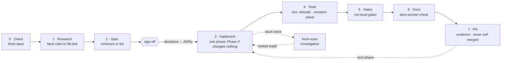

# Zethus 🪨

**A development process for GitHub Copilot, in a form Copilot can follow and enforce.** One custom
agent runs every change through research → spec → sign-off → phased implementation → tests → local
gates → a PR with evidence, and refuses to skip a stage. Ten standalone skills hold one procedure
each. Four Markdown templates and four stdlib Python scripts do the mechanical parts. Everything
installs into a repository's `.github/` folder, and nothing in it is specific to one organization.

> Amphion and his twin Zethus built the walls of Thebes. Amphion played his lyre and the stones set
> themselves. Zethus carried each stone by hand and set it true. [Amphion][amphion] is the
> Claude Code pipeline. This is its Copilot twin: same walls, the other brother's method.

## The procedure



The agent states which stage it's in at the top of every reply. It asks decisions as a short list
of options with the recommendation first and marked, and it records each answer as an ADR. Its
refusals are written into the agent file as a table. "Skip the spec" gets the minimum spec, about
ten minutes. "Just push, CI will tell us" gets the local gates. "Merge it" gets a no: a person
merges, only on green. One narrow exemption is written down too. A change with no behaviour change
(a typo, a comment, formatting) may skip research, spec and tests, but never gates, docs or the PR.

## What's in the kit

| File | Installs to | Purpose |
|---|---|---|
| [`copilot-instructions.md`](copilot-instructions.md) | `.github/copilot-instructions.md` | The standing rules, short and imperative. Copilot loads them for every request in the repo. |
| [`instructions/docs.instructions.md`](instructions/docs.instructions.md) | `.github/instructions/` | Path-scoped rules (`applyTo: "**/*.md"`): Markdown is canonical, router vs leaf docs, pointers resolve, spec status vocabulary, ADRs superseded rather than rewritten. |
| [`agents/zethus.agent.md`](agents/zethus.agent.md) | `.github/agents/` | **The enforcer.** The stage table with exit conditions, per-turn behaviour, and the refusal table. |
| [`skills/research-existing-code`](skills/research-existing-code/SKILL.md) | `.github/skills/` | Facts cited to `file:line`, the search behind every negative claim, and what the research did *not* cover. |
| [`skills/write-spec-minimum`](skills/write-spec-minimum/SKILL.md) | `.github/skills/` | The one-screen spec for one PR, and the fast path when someone says "just code it". |
| [`skills/write-spec-full`](skills/write-spec-full/SKILL.md) | `.github/skills/` | Verbatim ask, measured problem, facts, assumptions checked, options, phases, rollback, out of scope, open questions, then stop for sign-off. |
| [`skills/write-adr`](skills/write-adr/SKILL.md) | `.github/skills/` | One imperative decision sentence, options, consequences, *enforced where*, *revisit when*. Pastes cleanly into a wiki or ticket. |
| [`skills/fresh-eyes-investigation`](skills/fresh-eyes-investigation/SKILL.md) | `.github/skills/` | Artifact plus one line of intent in; ranked leads out, each established or conjecture. Never a diagnosis; an empty list is valid. |
| [`skills/implement-phase`](skills/implement-phase/SKILL.md) | `.github/skills/` | One phase per branch, Phase 0 first. Stay inside the phase; classify anything unplanned; keep an *As built* list. |
| [`skills/test-plan`](skills/test-plan/SKILL.md) | `.github/skills/` | Per-phase tests covering the change, the failure path, the refusal, and what must not change, plus a mutation check. |
| [`skills/pre-push-gates`](skills/pre-push-gates/SKILL.md) | `.github/skills/` | Every CI gate run locally, on the working tree, before a push. A skip is not a pass. |
| [`skills/pr-description`](skills/pr-description/SKILL.md) | `.github/skills/` | An evidence-first PR body diffed against the real integration branch, including *What was not checked*. |
| [`skills/docs-sync-check`](skills/docs-sync-check/SKILL.md) | `.github/skills/` | Fix the docs that describe the changed code in the same PR, in place. Leave every other doc alone. |
| [`templates/spec-full.md`](templates/spec-full.md) · [`spec-minimum.md`](templates/spec-minimum.md) | `.github/zethus/templates/` | Both spec shapes. The minimum spec's headings are a strict subset of the full spec's, so promoting one only adds sections. A test enforces this. |
| [`templates/adr.md`](templates/adr.md) | `.github/zethus/templates/` | The ADR record: a field table (including *Enforced where*), decision, context, options, consequences. |
| [`templates/pr.md`](templates/pr.md) | `.github/zethus/templates/` | The PR body: What · Why · Changes · Evidence · What was not checked · deferrals · decisions · docs · AI assistance. |
| [`scripts/run-local-gates.py`](scripts/run-local-gates.py) | `.github/zethus/scripts/` | Discovers and runs lint/build/test, then prints a PASS/FAIL/SKIP table and an explicit verdict. Exit codes: `0` full green · `1` red · `3` green but incomplete · `2` nothing to run. |
| [`scripts/new-adr.py`](scripts/new-adr.py) | `.github/zethus/scripts/` | Creates `docs/adr/YYYY-MM-DD-slug.md` and adds its row to the ADR index. Ids are keyed by date, so parallel branches never collide. |
| [`scripts/new-spec.py`](scripts/new-spec.py) | `.github/zethus/scripts/` | `new-spec.py full\|minimum "Title"` creates `docs/specs/<slug>.md` as `DRAFT`. |
| [`scripts/docs-pointer-check.py`](scripts/docs-pointer-check.py) | `.github/zethus/scripts/` | Fails on relative Markdown links that don't resolve, including case mismatches that only break on Linux. With `--sync-base`, it also lists docs whose described code changed (report-only). |
| [`zethus.config.example.json`](zethus.config.example.json) | `.github/zethus.config.json` | Project facts: integration branch, gate commands, spec and ADR dirs, the doc-to-code map, the AI co-author trailer. |
| [`install.py`](install.py) | — | Copies all of the above into place. Never clobbers the repo's own instructions file or config, and writes nothing if there are conflicts. |

The scripts are Python 3.10+ standard library only. There are no PowerShell twins: Python runs
natively on Windows, and a second implementation would be a second thing to drift.

## Install into a repository

```bash
git clone https://github.com/kumouri/claude-grimoire.git
python claude-grimoire/zethus/install.py --target path/to/your-repo --dry-run   # see the plan
python claude-grimoire/zethus/install.py --target path/to/your-repo
```

Then, in the target repo:

1. Edit `.github/zethus.config.json`. Set `gates.steps` to mirror your CI workflow, gate for gate.
   `run-local-gates.py --list` shows what it would run.
2. Commit the `.github/` changes in a PR like any other change.
3. In your Copilot chat, pick the **zethus** agent to run the whole procedure. Or invoke a single
   skill, such as `/write-spec-minimum` or `/fresh-eyes-investigation`, on its own.

If the repo already has a `.github/copilot-instructions.md`, the installer leaves it alone and
installs the rules as `.github/instructions/zethus.instructions.md` with `applyTo: "**"`. Copilot
combines path-specific and repository-wide instructions, so both apply. Copying by hand works too:
the *Installs to* column above is the whole mapping.

### Configuration

Every key is optional. Where a value is missing, the scripts and agent work it out from the
repository, then ask.

| Key | Used by | Meaning |
|---|---|---|
| `branchModel.base` | agent, `pr-description`, `docs-sync-check` | The integration branch. Default: `develop` if it exists, else the default branch. |
| `gates.steps[]` | `run-local-gates` | Ordered `{name, command, exitCode?}`. `command` is a string or an argv list; there's no shell. |
| `gates.lint` / `.build` / `.test` / `.mandatedChecks[]` | `run-local-gates` | Amphion's gate keys, read when `gates.steps` is absent. A mandated check with only a prose `expect` shows as **MANUAL** (not checked). |
| `spec.dir`, `spec.templates.{full,minimum}` | `new-spec` | Default `docs/specs`, and the kit's templates. |
| `adr.dir`, `adr.template` | `new-adr` | Default `docs/adr`, and the kit's template. |
| `docSync.map[]` | `docs-pointer-check --sync-base` | `{doc, describes[globs]}`: which code each doc describes. It is Amphion's key. Globs use `fnmatch` rules, so `*` also matches `/`. |
| `docs.pointerIgnore[]` | `docs-pointer-check` | Markdown files to skip, such as generated changelogs. |
| `commits.aiTrailer` | agent | The co-author trailer that AI-assisted commits carry. |

## Copilot formats used, and where they're documented

The formats were checked against GitHub's and VS Code's documentation in September 2026.

| Piece | Format | Documentation |
|---|---|---|
| Repository instructions | `.github/copilot-instructions.md`, plain Markdown | [Adding repository custom instructions][gh-repo-instructions] · [support matrix][gh-instructions-support] |
| Path-specific instructions | `.github/instructions/*.instructions.md` with `applyTo` | [VS Code custom instructions][vsc-instructions] |
| Custom agent | `.github/agents/*.agent.md`: `name`, `description`, `tools` | [Custom agents configuration][gh-agents-config] · [Creating custom agents][gh-agents-create] · [VS Code custom agents][vsc-agents] |
| Skills | `.github/skills/<name>/SKILL.md`: `name` (matches the folder), `description` | [About agent skills][gh-skills] · [Creating skills][gh-skills-create] · [VS Code agent skills][vsc-skills] |

**Why skills and not prompt files.** Prompt files (`.github/prompts/*.prompt.md`) work only in
IDEs, are in public preview, and are deprecated in current VS Code in favour of skills. Skills load
in VS Code and JetBrains agent mode, the Copilot CLI, and the Copilot cloud agent, and they can be
invoked by `/name` as well as picked automatically from their description. The agent's tool list
uses GitHub's portable aliases (`read`, `search`, `edit`, `execute`, `web`, `todo`, `agent`).
Surfaces that don't support a tool ignore it; for example, `web` and `todo` aren't used by the
cloud agent.

**The limit of enforcement.** Copilot has no hook that can block a tool call the way a
pre-tool-use hook can. So the agent enforces the process through its instructions, its stage
gates and its refusal table. The scripts give each stage an objective exit condition: an exit code
is harder to talk around than a sentence. Merging is protected by your platform's branch
protection, not by this kit.

## How it relates to Amphion

[Amphion][amphion] is a spec-to-PR pipeline of seven Markdown skills for Claude Code. Zethus uses
the same design where they overlap, rather than duplicating it:

- **One config vocabulary.** The keys that exist in both (`gates.*`, `branchModel.base`,
  `docSync.map`) mean the same thing. When `.github/zethus.config.json` is absent, the scripts read
  `.claude/amphion.config.json`, so a repo using both answers each question once.
- **Different stages.** Amphion covers what happens *after* the decisions: loading decided
  context, `flag-or-fix` when the spec runs out, `resume-interrupted-phase` when a delegate dies,
  `initialize-ci`, and `log-friction`. Zethus covers the *front* of the process, which Amphion
  assumes already happened: research, specs, ADRs and fresh-eyes investigation. It also covers the
  enforcement, which Amphion leaves to the operator. `implement-phase` points to Amphion's two
  exception handlers rather than re-implementing them.
- **Shared headings.** Zethus's `pr-description` keeps Amphion's *Not in this PR (intentional)*
  and *Noticed but out of scope* headings, so `flag-or-fix` deferrals land in the same place.
  `docs-sync-check` follows the same narrow rule as Amphion's `sync-claude-md`: change only the
  docs that describe code this diff touched, in place.
- **Installing both.** Amphion's skills use the same `SKILL.md` format, and Copilot can load
  them. If you copy them into `.github/skills/` too, skip Amphion's `pr-description`: Zethus's
  version adds to it (evidence, what was not checked, decisions) and has the same name.

## Maintaining this kit

- Keep it **organization-neutral**. It must contain no company, client, or project names and no
  private paths. A project-specific fact goes in a config key, not in the text.
- Keep the skills standalone. Each one must work when invoked alone, and cross-links between skills
  are relative (`../<skill>/SKILL.md`).
- Keep the scripts stdlib-only, with no shell and no network, and cover them in
  [`tests/test_zethus.py`](../tests/test_zethus.py). That file also enforces Copilot's frontmatter
  rules on every skill, the minimum ⊂ full spec contract, and that this kit's own Markdown has no
  broken pointers.
- When a Copilot format changes, update the table above along with the files that use it.

## License

[Apache-2.0](../LICENSE) © 2026 Ceryce Armstrong

[amphion]: https://github.com/kumouri/claude-grimoire/tree/develop/amphion
[gh-repo-instructions]: https://docs.github.com/en/copilot/how-tos/configure-custom-instructions/add-repository-instructions
[gh-instructions-support]: https://docs.github.com/en/copilot/reference/custom-instructions-support
[vsc-instructions]: https://code.visualstudio.com/docs/copilot/customization/custom-instructions
[gh-agents-config]: https://docs.github.com/en/copilot/reference/custom-agents-configuration
[gh-agents-create]: https://docs.github.com/en/copilot/how-tos/use-copilot-agents/cloud-agent/create-custom-agents
[vsc-agents]: https://code.visualstudio.com/docs/copilot/customization/custom-agents
[gh-skills]: https://docs.github.com/en/copilot/concepts/agents/about-agent-skills
[gh-skills-create]: https://docs.github.com/en/copilot/how-tos/use-copilot-agents/cloud-agent/create-skills
[vsc-skills]: https://code.visualstudio.com/docs/copilot/customization/agent-skills
